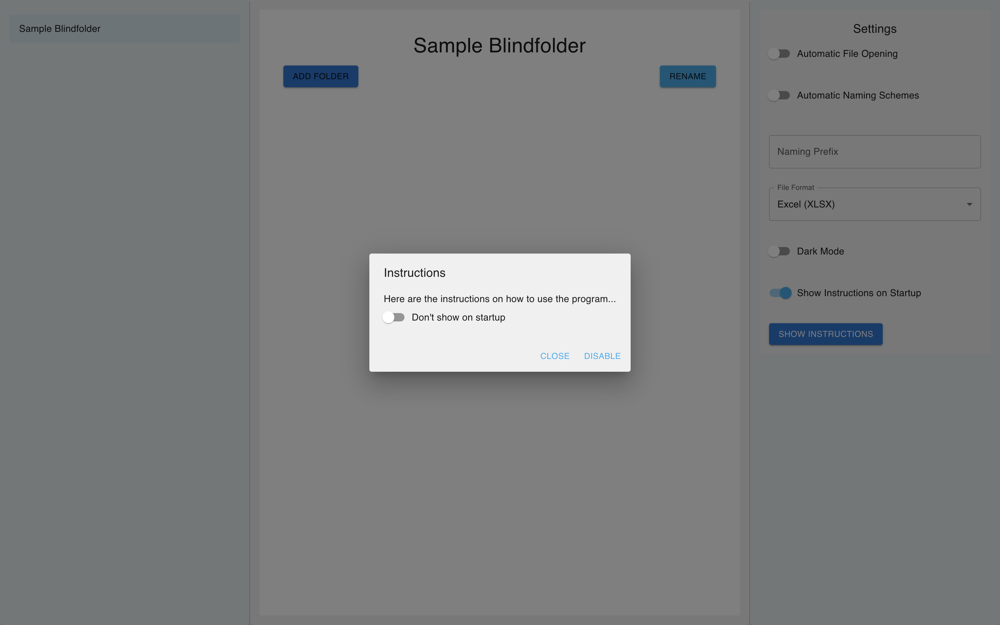
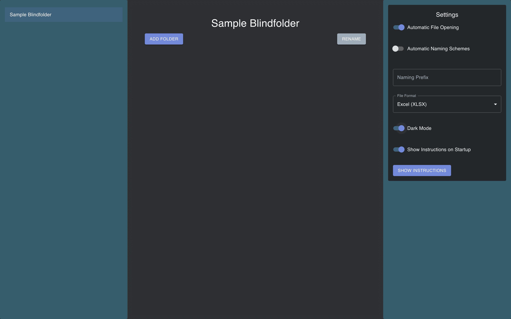
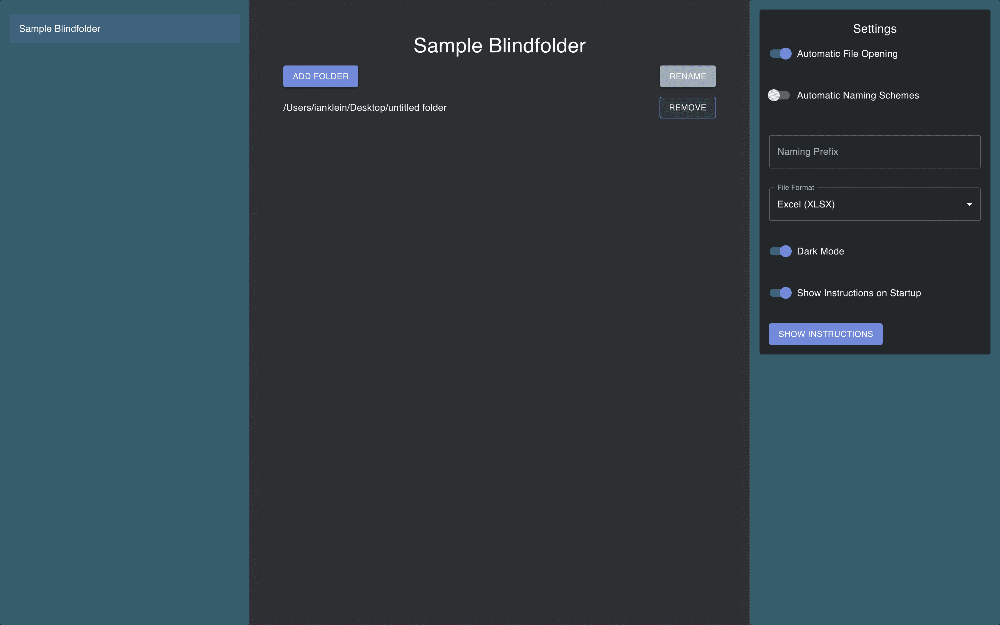
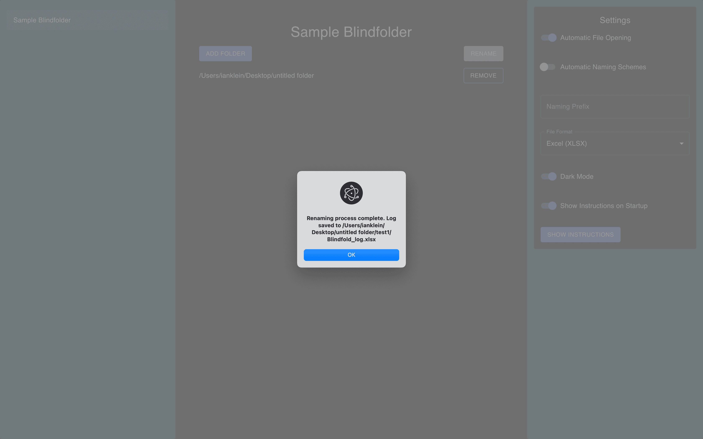

# BlindFolder 2.0

**Note**: I am happy to announce that this application is now in production and has been officially released: https://github.com/IanKlein6/Sample-Blindfolder-2.0/releases

## 1. Overview and Update

BlindFolder 2.0 is an upgraded version to the original Sample BlindFolder. This Electron-based desktop application, with a React frontend, automates the "blinding" of divers files types. Developed in collaboration with Medical Doctoral student Jost Wiggering at the University of Freiburg, this application is being used to generated blinded files of Confocal Microscopy samples of Drosophila cells and has significantly reduces bias and time required for manual blinding. The project will continue to be developed when new features are needed with the possibility of integrating additional programs in the future to enhance lab efficiency.

**Key Enhancements in 2.0:**
- **Improved User Interface:** A modern and user-friendly UI designed with Material-UI (MUI).
- **Dark Mode:** Toggle between light and dark themes for better usability.
- **Persistent Settings:** Save user preferences such as theme and automatic settings across sessions.
- **Interactive Modals:** Instructional and folder naming modals for enhanced user guidance.
- **Future Expansion:** Built with scalability in mind, allowing the addition of more programs to streamline various lab processes.
- **Update functuality** Integrated Update checker that alows users to stay up to date with future features or updates

## 2. How It Works

### Core Functionality

BlindFolder 2.0 provides:
- **Folder Selection and Renaming:** Select multiple folders and rename them efficiently.
- **Export Functionality:** Export data to Excel or CSV formats.

### User Interface

The application is divided into three sections:
1. **App Selector:** Choose the specific blinding application.
2. **Main App View:** Manage folders, add new folders, and rename them.
3. **Settings Panel:** Configure application settings, including dark mode, automatic file opening, and naming schemes, manual update checker.

### Screenshots

*Star View of Application*

*Main App View Dark*

*Multi Select Folders/Files*

*Main View after items are selected*

*Naming of deposit sample folder*

*Success message once files have been Blinded*

## 3. Conclusion

BlindFolder 2.0 is a robust, user-friendly application designed to enhance lab efficiency by automating the blinding of microscopy files. The project has addressed various challenges through iterative development and problem-solving, resulting in a modern, customizable tool. With plans for future expansion, BlindFolder 2.0 aims to further streamline lab processes and support advanced research needs.

## 4. Looking Ahead

This isn’t the end of the journey. BlindFolder 2.0 lays the foundation for future expansion — whether that means supporting new scientific workflows, integrating additional image processing steps, or deploying the app across more labs.
If you’re interested in contributing ideas or collaborating on future features, feel free to reach out.

**Acknowledgments**

Special thanks to Jost Wiggering for the collaboration.
