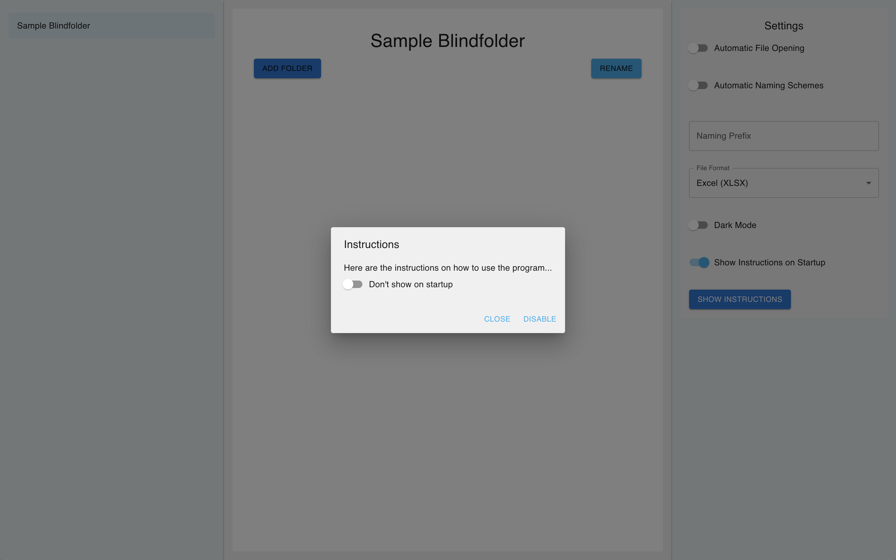
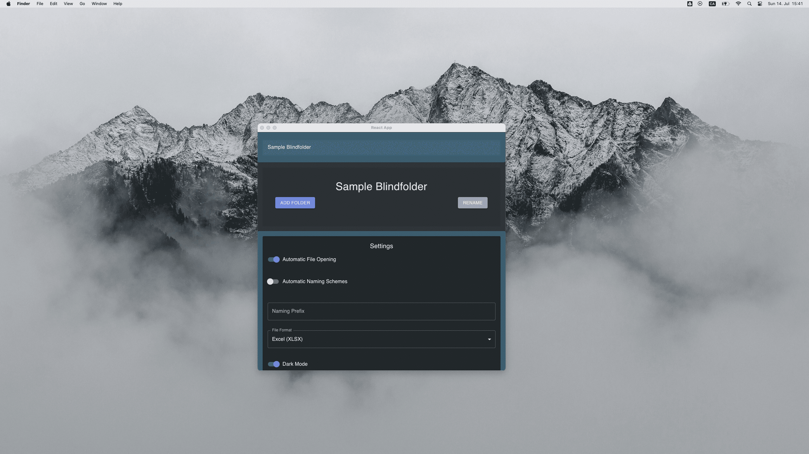
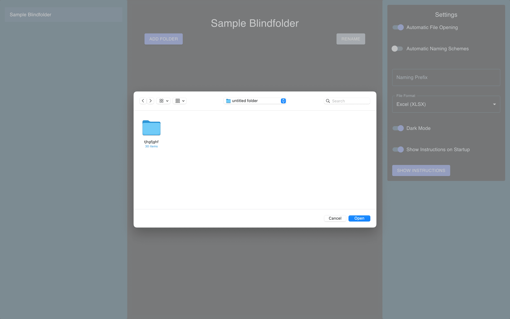
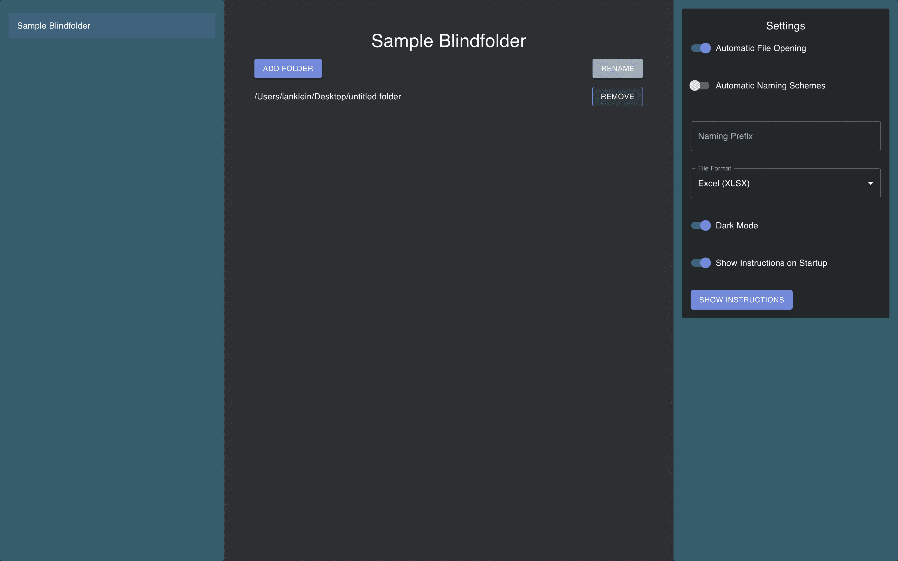
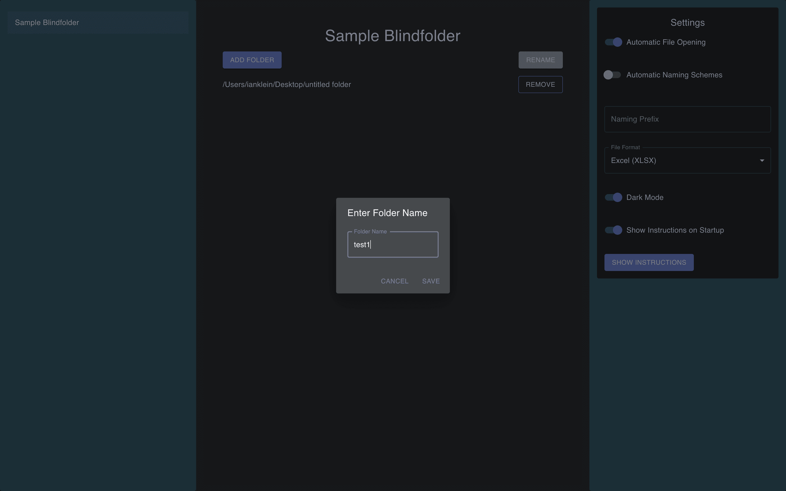

# Sample BlindFolder 2.0

**Note**: This application is still in development and is not yet complete.

## 1. Overview and Update

Sample BlindFolder 2.0 is an upgraded version of the original Sample BlindFolder. This Electron-based desktop application, with a React frontend, automates the blinding of files generated through confocal microscopy of Drosophila cells. Developed in collaboration with medical doctoral student Jost Wiggering at the University of Freiburg, this application significantly reduces bias and time required for manual blinding. The project is still under development, with plans to integrate additional programs in the future to enhance lab efficiency.

**Key Enhancements in 2.0:**
- **Improved User Interface:** A modern and user-friendly UI designed with Material-UI (MUI).
- **Dark Mode:** Toggle between light and dark themes for better usability.
- **Persistent Settings:** Save user preferences such as theme and automatic settings across sessions.
- **Interactive Modals:** Instructional and folder naming modals for enhanced user guidance.
- **Future Expansion:** Built with scalability in mind, allowing the addition of more programs to streamline various lab processes.

## 2. How It Works

### Core Functionality

Sample BlindFolder 2.0 provides:
- **Folder Selection and Renaming:** Select multiple folders and rename them efficiently.
- **Export Functionality:** Export data to Excel or CSV formats.

### User Interface

The application is divided into three sections:
1. **App Selector:** Choose the specific blinding application.
2. **Main App View:** Manage folders, add new folders, and rename them.
3. **Settings Panel:** Configure application settings, including dark mode, automatic file opening, and naming schemes.

### Screenshots

*Star View of Application*

*Main App View Dark*

*Main View for small screen sizes*

*Multi Select Folders/Files*

*Main View after items are selected*

*Naming of deposit sample folder*

*Success message once files have been Blinded*

## 3. Problems Encountered and Fixes

### Module Resolution Issues
**Problem:** Initial issues with module resolution, particularly with MUI icons.
**Solution:** Corrected imports and ensured all necessary packages were installed.

### Unresponsive UI During Development
**Problem:** Buttons and popups became unresponsive during hot reloads.
**Solution:** Addressed state management issues, ensured consistent handling of component keys, and restarted the development server when necessary.

### State Persistence and Initialization
**Problem:** Ensuring that settings persisted across sessions.
**Solution:** Utilized `localStorage` to save and load settings. Implemented proper initialization of state in React components.

### Styling and Theming
**Problem:** Creating a visually appealing and consistent theme for the application.
**Solution:** Iteratively developed and adjusted the theme using MUI’s theming capabilities. Tried multiple color schemes to achieve a professional and modern look.

### Component Layout Issues
**Problem:** Ensuring that components were responsive and maintained a consistent layout across different screen sizes.
**Solution:** Utilized MUI’s Grid system and Box components for flexible and responsive layout design.

### Instruction Modal Persistence
**Problem:** Displaying an instruction modal on first load and providing a way to disable it.
**Solution:** Implemented a modal that checks `localStorage` for a flag to determine whether to display on startup. Added a setting to toggle this behavior.

## 4. Conclusion

Sample BlindFolder 2.0 is a robust, user-friendly application designed to enhance lab efficiency by automating the blinding of microscopy files. The project has addressed various challenges through iterative development and problem-solving, resulting in a modern, customizable tool. With plans for future expansion, Sample BlindFolder 2.0 aims to further streamline lab processes and support advanced research needs.

**Acknowledgments**

Special thanks to Jost Wiggering for the collaboration.
